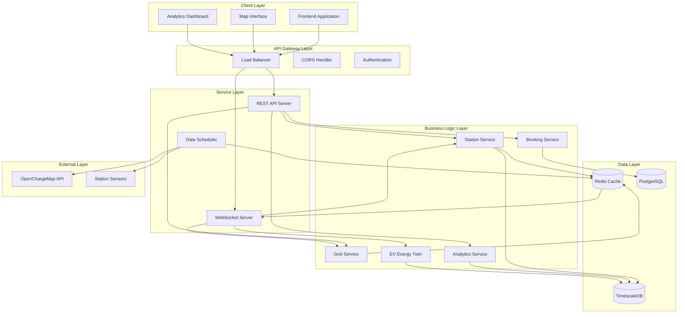
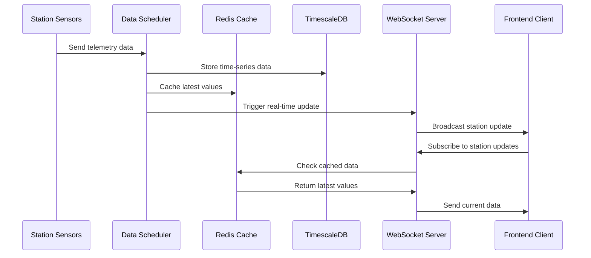

# Design Document: Grid Monitoring Backend API

## Overview

The Grid Monitoring Backend API is a real-time electrical grid monitoring system that provides live data streams, analytics, and external API integrations for the Transformer Sentinel Protocol frontend. The system replaces mock data with actual real-time monitoring capabilities while maintaining exact compatibility with existing frontend data structures.

The architecture follows a microservices approach with three core layers: **Data Layer** (PostgreSQL with TimescaleDB for time-series data), **Service Layer** (Node.js/Express with WebSocket support), and **Integration Layer** (external API connectors and caching). The system is designed to handle 100+ stations with sub-200ms API response times and sub-100ms WebSocket latency.

Key architectural decisions include using TimescaleDB for efficient time-series data storage, Redis for caching and real-time data distribution, and Socket.IO for reliable WebSocket connections with automatic fallback mechanisms. The system implements event-driven architecture for real-time updates and uses connection pooling for database optimization.

## Architecture

### System Architecture



### Technology Stack

**Backend Framework**: Node.js with Express.js for REST API and Socket.IO for WebSocket connections
- **Rationale**: Excellent real-time capabilities, large ecosystem, and proven scalability for I/O-intensive applications

**Database**: PostgreSQL with TimescaleDB extension for time-series data
- **Rationale**: TimescaleDB provides optimized time-series storage while maintaining SQL compatibility and ACID properties

**Caching**: Redis for session management, real-time data distribution, and API response caching
- **Rationale**: High-performance in-memory storage ideal for real-time data distribution and caching

**External Integration**: Axios for HTTP clients with retry logic and circuit breaker patterns
- **Rationale**: Robust HTTP client with built-in error handling and timeout management

## Components and Interfaces

### Core Services

#### Station Service
**Responsibilities**: Manages electrical station data, status classification, and real-time monitoring
**Key Methods**:
- `getAllStations()`: Returns all stations with current status
- `getStationById(id)`: Returns detailed station information
- `updateStationData(id, data)`: Updates station telemetry data
- `classifyStationStatus(temp, load)`: Determines station status based on thresholds
- `getStationTelemetry(id, timeRange)`: Returns historical telemetry data

**Interface**:
```typescript
interface StationService {
  getAllStations(): Promise<Station[]>;
  getStationById(id: string): Promise<Station | null>;
  updateStationData(id: string, data: StationTelemetry): Promise<void>;
  getStationTelemetry(id: string, timeRange: TimeRange): Promise<TelemetryData[]>;
  subscribeToUpdates(callback: (station: Station) => void): void;
}
```

#### Grid Service
**Responsibilities**: Aggregates grid-wide metrics, calculates system-level statistics, and manages alerts
**Key Methods**:
- `getGridStatistics()`: Returns aggregated grid metrics
- `calculateGridStress()`: Determines overall grid stress level
- `getActiveAlerts()`: Returns current system alerts
- `calculateEfficiency()`: Computes grid efficiency percentage

**Interface**:
```typescript
interface GridService {
  getGridStatistics(): Promise<GridStats>;
  getActiveAlerts(): Promise<Alert[]>;
  createAlert(alert: AlertData): Promise<Alert>;
  resolveAlert(alertId: string): Promise<void>;
  subscribeToGridUpdates(callback: (stats: GridStats) => void): void;
}
```

#### Analytics Service
**Responsibilities**: Processes usage patterns, generates demand predictions, and creates operational metrics
**Key Methods**:
- `generateUsageHeatmap(timeRange)`: Creates usage pattern heatmaps
- `getDemandPredictions(horizon)`: Returns demand forecasts with confidence intervals
- `getOperationalMetrics()`: Calculates utilization and efficiency metrics
- `updateAnalyticsData()`: Processes new data for analytics

**Interface**:
```typescript
interface AnalyticsService {
  generateUsageHeatmap(timeRange: TimeRange): Promise<HeatmapData[]>;
  getDemandPredictions(horizon: number): Promise<DemandPrediction[]>;
  getOperationalMetrics(): Promise<OperationalMetrics>;
  scheduleAnalyticsUpdate(): void;
}
```

#### EV Energy Twin Service
**Responsibilities**: Manages EV charging station telemetry, asset information, and real-time monitoring
**Key Methods**:
- `getAssetInfo(assetId)`: Returns asset specifications and ratings
- `getTelemetryData(assetId, timeRange)`: Returns historical telemetry
- `streamRealTimeData(assetId)`: Provides real-time data stream
- `checkTemperatureLimits(reading)`: Validates temperature against thresholds

**Interface**:
```typescript
interface EVEnergyTwinService {
  getAssetInfo(assetId: string): Promise<AssetInfo>;
  getTelemetryData(assetId: string, timeRange: TimeRange): Promise<EVEnergyData[]>;
  streamRealTimeData(assetId: string): AsyncIterator<EVEnergyData>;
  updateTemperatureReading(assetId: string, reading: TemperatureReading): Promise<void>;
}
```

#### Booking Service
**Responsibilities**: Handles EV charging bookings, grid impact analysis, and optimization
**Key Methods**:
- `createBooking(request)`: Initiates booking with grid impact analysis
- `analyzeGridImpact(booking)`: Evaluates booking impact on grid stability
- `optimizeChargingSchedule(booking)`: Provides optimized charging times
- `getBookingStatus(bookingId)`: Returns current booking status

**Interface**:
```typescript
interface BookingService {
  createBooking(request: BookingRequest): Promise<Booking>;
  getBookingStatus(bookingId: string): Promise<BookingStatus>;
  analyzeGridImpact(booking: BookingRequest): Promise<GridImpactAnalysis>;
  optimizeSchedule(booking: BookingRequest): Promise<OptimizedSchedule>;
}
```

### External Integration Components

#### OpenChargeMap Connector
**Responsibilities**: Integrates with OpenChargeMap API, handles data transformation, and manages fallback scenarios
**Key Features**:
- Radius-based station search (5km → 25km → 100km escalation)
- Data normalization and transformation to internal format
- Caching strategy for API responses
- Automatic fallback to simulation mode on API failures

**Interface**:
```typescript
interface OCMConnector {
  searchStations(location: Coordinates, radius: number): Promise<OCMStation[]>;
  transformToInternalFormat(ocmData: OCMStation[]): Station[];
  enableFallbackMode(): void;
  getCachedData(location: Coordinates): Promise<Station[] | null>;
}
```

### Real-Time Communication Layer

#### WebSocket Manager
**Responsibilities**: Manages WebSocket connections, handles real-time data distribution, and ensures reliable delivery
**Key Features**:
- Connection lifecycle management
- Room-based subscription system
- Automatic reconnection handling
- Message queuing for offline clients

**Interface**:
```typescript
interface WebSocketManager {
  broadcastStationUpdate(station: Station): void;
  broadcastGridUpdate(stats: GridStats): void;
  broadcastAlert(alert: Alert): void;
  subscribeToStation(clientId: string, stationId: string): void;
  unsubscribeFromStation(clientId: string, stationId: string): void;
}
```

## Data Models

### Core Data Structures

#### Station Model
```typescript
interface Station {
  id: string;              // Unique station identifier
  name: string;            // Human-readable station name
  lat: number;             // Latitude coordinate
  lng: number;             // Longitude coordinate
  status: StationStatus;   // Current operational status
  load: number;            // Current load percentage (0-100)
  temp: number;            // Current temperature in Celsius
  address: string;         // Physical address
  capacity: number;        // Station capacity score
  lastUpdated: Date;       // Last data update timestamp
}

type StationStatus = 'safe' | 'warning' | 'critical';
```

#### Grid Statistics Model
```typescript
interface GridStats {
  totalLoad: string;       // Total grid load (e.g., "842 MW")
  gridStress: string;      // Overall grid status
  activeAlerts: number;    // Number of active alerts
  efficiency: string;      // Grid efficiency percentage
  lastCalculated: Date;    // Last calculation timestamp
  stationCount: number;    // Total number of stations
  criticalStations: number; // Count of critical status stations
}
```

#### Telemetry Data Model
```typescript
interface TelemetryData {
  id: string;
  stationId: string;
  timestamp: Date;
  temperature: number;
  load: number;
  voltage?: number;
  current?: number;
  powerFactor?: number;
}
```

#### EV Energy Data Model
```typescript
interface EVEnergyData {
  time: string;            // ISO timestamp
  temp: number;            // Temperature reading
  limit: number;           // Temperature limit (110°C)
  assetId: string;         // Asset identifier
  reading_id: string;      // Unique reading identifier
}

interface AssetInfo {
  id: string;              // Asset ID (e.g., "TX-2049-NYC")
  rating: string;          // Equipment rating (e.g., "2500 kVA")
  type: string;            // Asset type
  installDate: Date;       // Installation date
  lastMaintenance: Date;   // Last maintenance date
}
```

#### Analytics Data Models
```typescript
interface HeatmapDataPoint {
  day: string;             // Day of week (Mon, Tue, etc.)
  hour: number;            // Hour of day (0-23)
  value: number;           // Usage intensity (0-100)
}

interface DemandPredictionPoint {
  time: string;            // Time label
  actual?: number;         // Historical actual values
  predicted?: number;      // Predicted future values
  lowerBound?: number;     // Prediction confidence lower bound
  upperBound?: number;     // Prediction confidence upper bound
}

interface OperationalMetrics {
  optimalHours: string[];  // Best charging times
  energyDelivered: number; // Total kWh delivered
  utilizationRate: number; // Utilization percentage
  peakHours: string;       // Peak usage period
  quietHours: string;      // Low usage period
  carbonSaved: number;     // Environmental impact (kg CO2)
}
```

#### Booking System Models
```typescript
interface BookingRequest {
  userId: string;
  stationId: string;
  requestedTime: Date;
  duration: number;        // Duration in minutes
  energyRequired: number;  // kWh required
}

interface Booking {
  id: string;
  userId: string;
  stationId: string;
  status: BookingStatus;
  requestedTime: Date;
  optimizedTime?: Date;
  duration: number;
  energyRequired: number;
  gridImpactScore?: number;
  createdAt: Date;
  updatedAt: Date;
}

type BookingStatus = 'idle' | 'analyzing' | 'conflict' | 'optimized' | 'confirmed';
```

### Database Schema Design

#### TimescaleDB Tables (Time-Series Data)
```sql
-- Station telemetry data (hypertable)
CREATE TABLE station_telemetry (
  time TIMESTAMPTZ NOT NULL,
  station_id VARCHAR(50) NOT NULL,
  temperature DECIMAL(5,2),
  load_percentage DECIMAL(5,2),
  voltage DECIMAL(8,2),
  current DECIMAL(8,2),
  power_factor DECIMAL(4,3),
  status VARCHAR(20),
  PRIMARY KEY (time, station_id)
);

-- Convert to hypertable for time-series optimization
SELECT create_hypertable('station_telemetry', 'time');

-- EV energy twin data (hypertable)
CREATE TABLE ev_energy_readings (
  time TIMESTAMPTZ NOT NULL,
  asset_id VARCHAR(50) NOT NULL,
  temperature DECIMAL(5,2),
  limit_temperature DECIMAL(5,2) DEFAULT 110.0,
  reading_id UUID DEFAULT gen_random_uuid(),
  PRIMARY KEY (time, asset_id)
);

SELECT create_hypertable('ev_energy_readings', 'time');
```

#### PostgreSQL Tables (Relational Data)
```sql
-- Station master data
CREATE TABLE stations (
  id VARCHAR(50) PRIMARY KEY,
  name VARCHAR(200) NOT NULL,
  latitude DECIMAL(10,8) NOT NULL,
  longitude DECIMAL(11,8) NOT NULL,
  address TEXT,
  capacity INTEGER,
  created_at TIMESTAMPTZ DEFAULT NOW(),
  updated_at TIMESTAMPTZ DEFAULT NOW()
);

-- Asset information
CREATE TABLE assets (
  id VARCHAR(50) PRIMARY KEY,
  rating VARCHAR(50),
  asset_type VARCHAR(50),
  install_date DATE,
  last_maintenance DATE,
  station_id VARCHAR(50) REFERENCES stations(id)
);

-- Booking system
CREATE TABLE bookings (
  id UUID PRIMARY KEY DEFAULT gen_random_uuid(),
  user_id VARCHAR(50) NOT NULL,
  station_id VARCHAR(50) REFERENCES stations(id),
  status VARCHAR(20) NOT NULL,
  requested_time TIMESTAMPTZ NOT NULL,
  optimized_time TIMESTAMPTZ,
  duration INTEGER NOT NULL,
  energy_required DECIMAL(8,2),
  grid_impact_score DECIMAL(5,2),
  created_at TIMESTAMPTZ DEFAULT NOW(),
  updated_at TIMESTAMPTZ DEFAULT NOW()
);

-- Alerts and notifications
CREATE TABLE alerts (
  id UUID PRIMARY KEY DEFAULT gen_random_uuid(),
  station_id VARCHAR(50) REFERENCES stations(id),
  alert_type VARCHAR(50) NOT NULL,
  severity VARCHAR(20) NOT NULL,
  message TEXT,
  resolved BOOLEAN DEFAULT FALSE,
  created_at TIMESTAMPTZ DEFAULT NOW(),
  resolved_at TIMESTAMPTZ
);
```

### Data Flow Architecture



## Correctness Properties

*A property is a characteristic or behavior that should hold true across all valid executions of a system—essentially, a formal statement about what the system should do. Properties serve as the bridge between human-readable specifications and machine-verifiable correctness guarantees.*

Based on the prework analysis and property reflection to eliminate redundancy, the following properties validate the core correctness requirements of the grid monitoring system:

### Property 1: Station Status Classification
*For any* station with temperature and load readings, the status classification should follow the rules: critical when temp ≥ 110°C OR load > 90%, warning when temp ≥ 85°C OR load > 70% (and not critical), safe otherwise
**Validates: Requirements 1.2, 1.3, 1.4, 9.3**

### Property 2: Station Data Completeness
*For any* station returned by the API, all required fields (id, name, lat, lng, status, load, temp, address) should be present and properly formatted
**Validates: Requirements 1.1, 8.5**

### Property 3: Grid Load Aggregation
*For any* set of stations, the total grid load should equal the sum of individual station loads
**Validates: Requirements 2.1**

### Property 4: Grid Statistics Calculation
*For any* collection of stations and alerts, grid statistics should accurately reflect the count of stations, active alerts, and overall grid stress level based on station statuses
**Validates: Requirements 2.2, 2.3, 2.4**

### Property 5: Alert Broadcasting
*For any* new alert created in the system, it should be broadcast to all connected WebSocket clients
**Validates: Requirements 3.4**

### Property 6: EV Energy Data Structure
*For any* EV energy twin request, historical data should have 15-minute intervals, exactly 20 data points, and temperature limits consistently set to 110°C
**Validates: Requirements 4.1, 4.3, 4.5**

### Property 7: Asset Information Completeness
*For any* asset in the system, the asset information should include ID and rating fields
**Validates: Requirements 4.4**

### Property 8: EV Energy Streaming
*For any* asset ID, the real-time temperature streaming should provide temperature readings when requested
**Validates: Requirements 4.2**

### Property 9: Analytics Data Structure
*For any* analytics request, heatmap data should cover all days and hours, predictions should include confidence intervals, and operational metrics should include all required fields
**Validates: Requirements 5.1, 5.2, 5.3, 5.4**

### Property 10: Booking Conflict Detection
*For any* booking request when grid conditions are critical, the system should detect conflicts and provide alternatives
**Validates: Requirements 6.2**

### Property 11: Booking State Transitions
*For any* booking, successful optimization should lead to confirmation, and status should transition through the expected sequence (idle → analyzing → conflict/optimized → confirmed)
**Validates: Requirements 6.4, 6.5**

### Property 12: OCM API Integration
*For any* location and radius combination (5km, 25km, 100km), the OCM API should return search results and transform them to internal station format
**Validates: Requirements 7.1, 7.3, 7.5**

### Property 13: OCM Fallback Behavior
*For any* OCM API failure, the system should automatically switch to simulation mode
**Validates: Requirements 7.2**

### Property 14: OCM Response Caching
*For any* repeated OCM API request with identical parameters, the system should return cached data when appropriate
**Validates: Requirements 7.4**

### Property 15: REST API Completeness
*For any* required API endpoint (stations, grid status, analytics, bookings), the endpoint should exist and respond with properly formatted data
**Validates: Requirements 8.1, 8.3, 8.4**

### Property 16: Input Validation
*For any* temperature reading outside 40-84°C range or load percentage outside 0-100% range, the system should reject the invalid data and log validation errors
**Validates: Requirements 9.1, 9.2, 9.4, 9.5**

## Error Handling

### Error Classification Strategy

The system implements a three-tier error handling approach:

**Tier 1: Input Validation Errors**
- Temperature readings outside safe ranges (40-84°C)
- Load percentages outside operational limits (0-100%)
- Invalid station IDs or malformed requests
- **Response**: Return 400 Bad Request with descriptive error message
- **Logging**: Log validation errors for monitoring

**Tier 2: External Service Errors**
- OpenChargeMap API failures or timeouts
- Database connection issues
- Redis cache unavailability
- **Response**: Implement circuit breaker pattern and fallback mechanisms
- **Logging**: Log service errors with retry attempts

**Tier 3: System-Level Errors**
- Unexpected application errors
- Memory or resource exhaustion
- Critical system failures
- **Response**: Return 500 Internal Server Error, maintain system stability
- **Logging**: Log critical errors with full stack traces

### Fallback Mechanisms

**OpenChargeMap API Fallback**:
```typescript
async function getStationsWithFallback(location: Coordinates): Promise<Station[]> {
  try {
    return await ocmConnector.searchStations(location, 5);
  } catch (error) {
    logger.warn('OCM API unavailable, switching to simulation mode');
    return simulationService.generateStations(location);
  }
}
```

**Database Connection Fallback**:
```typescript
async function getStationDataWithFallback(stationId: string): Promise<Station | null> {
  try {
    return await database.getStation(stationId);
  } catch (error) {
    logger.error('Database unavailable, using cached data');
    return await redis.getStation(stationId);
  }
}
```

**WebSocket Connection Handling**:
```typescript
// Automatic reconnection with exponential backoff
socket.on('disconnect', () => {
  const reconnectDelay = Math.min(1000 * Math.pow(2, reconnectAttempts), 30000);
  setTimeout(() => reconnect(), reconnectDelay);
});
```

### Error Response Format

All API errors follow a consistent format:
```typescript
interface ErrorResponse {
  error: {
    code: string;           // Error code (e.g., "INVALID_TEMPERATURE")
    message: string;        // Human-readable error message
    details?: any;          // Additional error context
    timestamp: string;      // ISO timestamp
    requestId: string;      // Unique request identifier
  }
}
```

## Testing Strategy

### Dual Testing Approach

The system employs both unit testing and property-based testing for comprehensive coverage:

**Unit Tests**: Focus on specific examples, edge cases, and error conditions
- Integration points between components
- Specific error scenarios and edge cases
- Mock external dependencies for isolated testing
- Validate specific business logic examples

**Property Tests**: Verify universal properties across all inputs
- Generate random test data to validate properties
- Test system behavior across wide input ranges
- Validate correctness properties from design document
- Ensure system robustness under various conditions

### Property-Based Testing Configuration

**Testing Library**: fast-check for Node.js property-based testing
- **Rationale**: Mature library with excellent TypeScript support and comprehensive generators

**Test Configuration**:
- Minimum 100 iterations per property test (due to randomization)
- Each property test references its design document property
- Tag format: **Feature: grid-monitoring-backend-api, Property {number}: {property_text}**

**Example Property Test Structure**:
```typescript
import fc from 'fast-check';

describe('Station Status Classification', () => {
  it('should classify station status correctly', () => {
    // Feature: grid-monitoring-backend-api, Property 1: Station Status Classification
    fc.assert(fc.property(
      fc.float({ min: 0, max: 150 }), // temperature
      fc.float({ min: 0, max: 100 }), // load
      (temp, load) => {
        const status = classifyStationStatus(temp, load);
        
        if (temp >= 110 || load > 90) {
          expect(status).toBe('critical');
        } else if (temp >= 85 || load > 70) {
          expect(status).toBe('warning');
        } else {
          expect(status).toBe('safe');
        }
      }
    ));
  });
});
```

### Testing Layers

**Unit Testing Layer**:
- Service layer testing with mocked dependencies
- Database query testing with test database
- API endpoint testing with supertest
- WebSocket event testing with mock clients

**Integration Testing Layer**:
- End-to-end API testing with real database
- WebSocket integration testing
- External API integration testing with mock servers
- Cache integration testing with Redis

**Property Testing Layer**:
- Each correctness property implemented as property-based test
- Random data generation for comprehensive input coverage
- Invariant testing across system operations
- Round-trip testing for data serialization/deserialization

### Performance Testing Requirements

**Load Testing**:
- Test system with 100+ concurrent stations
- Validate API response times under load
- Test WebSocket connection scalability
- Database performance under high write loads

**Stress Testing**:
- Test system behavior at capacity limits
- Validate graceful degradation under extreme load
- Test recovery after system stress
- Memory and resource usage monitoring

The testing strategy ensures both functional correctness through property-based testing and system reliability through comprehensive unit and integration testing.