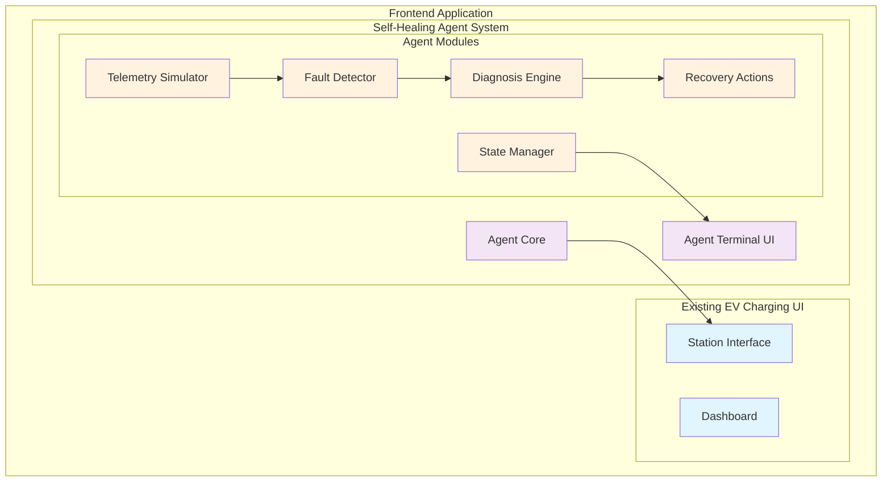

# Design Document: Self-Healing AI Agent

## Overview

The Self-Healing AI Agent is a frontend-only, rule-based autonomous control system that creates the illusion of intelligent fault detection and recovery for EV charging stations. The system uses a finite state machine architecture with deterministic rules to provide rapid, automated responses to charging station faults while delivering a compelling visual demonstration of AI-like behavior.

The core design philosophy is "demo-first" - prioritizing visual impact and storytelling over technical complexity. The system operates entirely in the browser, requires no backend modifications, and integrates seamlessly with existing EV charging station interfaces.

## Architecture

### High-Level Architecture



### System Integration Strategy

The agent system follows a **non-invasive integration pattern**:

1. **Additive Architecture**: All agent components are added alongside existing code without modification
2. **Event-Driven Integration**: Agent responds to existing UI events and state changes
3. **Isolated State Management**: Agent maintains its own state separate from existing application state
4. **Optional Rendering**: Agent UI components render conditionally and can be completely removed

## Components and Interfaces

### Core Agent State Machine

```typescript
interface AgentState {
  phase: 'STABLE' | 'CRITICAL' | 'DIAGNOSING' | 'EXECUTING' | 'RESOLVED';
  stationId: string;
  currentFault?: FaultEvent;
  diagnosis?: DiagnosisResult;
  recoveryPlan?: RecoveryPlan;
  startTime: number;
  logs: AgentLog[];
}

interface StateTransition {
  from: AgentState['phase'];
  to: AgentState['phase'];
  trigger: string;
  condition?: (state: AgentState) => boolean;
}
```

### Telemetry Simulator

**Purpose**: Generate realistic charging station telemetry data with controllable fault injection.

```typescript
interface TelemetryData {
  stationId: string;
  timestamp: number;
  voltage: number;        // 200-250V normal, outside range = fault
  current: number;        // 0-32A normal, spikes = fault
  temperature: number;    // 20-40°C normal, >60°C = overheat
  powerOutput: number;    // 0-7.4kW normal
  connectionStatus: 'connected' | 'disconnected' | 'error';
  chargingState: 'idle' | 'charging' | 'complete' | 'fault';
}

interface TelemetrySimulator {
  generateNormalTelemetry(stationId: string): TelemetryData;
  injectFault(stationId: string, faultType: FaultType): void;
  startSimulation(stationId: string, intervalMs: number): void;
  stopSimulation(stationId: string): void;
}
```

### Fault Detector

**Purpose**: Analyze telemetry streams to identify anomalous conditions using threshold-based rules.

```typescript
interface FaultEvent {
  id: string;
  stationId: string;
  type: FaultType;
  severity: 'warning' | 'critical';
  detectedAt: number;
  telemetrySnapshot: TelemetryData;
  description: string;
}

type FaultType = 
  | 'overvoltage' 
  | 'undervoltage' 
  | 'overcurrent' 
  | 'overtemperature' 
  | 'connection_lost' 
  | 'charging_stalled';

interface FaultDetector {
  analyzeTelemetry(data: TelemetryData): FaultEvent | null;
  setThresholds(stationId: string, thresholds: FaultThresholds): void;
  getActiveFaults(stationId: string): FaultEvent[];
}
```

### Diagnosis Engine

**Purpose**: Determine root causes of detected faults using rule-based decision trees.

```typescript
interface DiagnosisResult {
  faultId: string;
  rootCause: string;
  confidence: number;     // 0.0 - 1.0
  reasoning: string[];    // Step-by-step reasoning for UI display
  recommendedActions: string[];
  estimatedRecoveryTime: number; // milliseconds
}

interface DiagnosisEngine {
  diagnose(fault: FaultEvent, telemetryHistory: TelemetryData[]): DiagnosisResult;
  addDiagnosisRule(rule: DiagnosisRule): void;
  explainReasoning(diagnosis: DiagnosisResult): string[];
}
```

### Recovery Actions

**Purpose**: Execute automated recovery procedures based on diagnosis results.

```typescript
interface RecoveryAction {
  id: string;
  name: string;
  description: string;
  estimatedDuration: number;
  execute: (stationId: string) => Promise<RecoveryResult>;
}

interface RecoveryResult {
  success: boolean;
  message: string;
  newState?: Partial<TelemetryData>;
  nextActions?: string[];
}

interface RecoveryActions {
  executeRecovery(diagnosis: DiagnosisResult): Promise<RecoveryResult>;
  getAvailableActions(faultType: FaultType): RecoveryAction[];
  registerAction(action: RecoveryAction): void;
}
```

### Agent Terminal UI

**Purpose**: Provide real-time visual feedback of agent reasoning and actions.

```typescript
interface TerminalProps {
  agentState: AgentState;
  isVisible: boolean;
  onClose: () => void;
}

interface TerminalMessage {
  id: string;
  timestamp: number;
  type: 'thinking' | 'action' | 'result' | 'error';
  content: string;
  delay?: number; // Artificial delay for realistic timing
}
```

## Data Models

### Agent Configuration

```typescript
interface AgentConfig {
  stationId: string;
  enabled: boolean;
  faultThresholds: FaultThresholds;
  recoveryTimeout: number;
  uiSettings: {
    terminalAutoOpen: boolean;
    thinkingDelay: number;
    actionDelay: number;
  };
}

interface FaultThresholds {
  voltage: { min: number; max: number };
  current: { max: number };
  temperature: { max: number };
  responseTime: number; // Max time for fault detection
}
```

### State Persistence

```typescript
interface AgentSession {
  sessionId: string;
  stationId: string;
  startTime: number;
  events: AgentEvent[];
  metrics: {
    faultsDetected: number;
    successfulRecoveries: number;
    averageRecoveryTime: number;
  };
}

interface AgentEvent {
  timestamp: number;
  type: 'fault_detected' | 'diagnosis_complete' | 'recovery_started' | 'recovery_complete';
  data: any;
}
```

## Correctness Properties

*A property is a characteristic or behavior that should hold true across all valid executions of a system—essentially, a formal statement about what the system should do. Properties serve as the bridge between human-readable specifications and machine-verifiable correctness guarantees.*

Before defining the correctness properties, I need to analyze the acceptance criteria to determine which ones are testable as properties.

<function_calls>
<invoke name="prework">
<parameter name="featureName">self-healing-ai-agent

### Property Reflection

After analyzing all acceptance criteria, I identified several areas where properties can be consolidated to eliminate redundancy:

**Performance Properties**: Multiple criteria test timing (100ms fault detection, 400ms total cycle, 16ms UI rendering). These can be combined into comprehensive performance properties rather than separate timing tests.

**State Transition Properties**: Several criteria test state transitions (STABLE→CRITICAL, CRITICAL→DIAGNOSING, etc.). These can be consolidated into a single state machine validation property.

**UI Behavior Properties**: Multiple criteria test terminal display behavior. These can be combined into comprehensive UI consistency properties.

**Telemetry Properties**: Several criteria test telemetry generation and processing. These can be consolidated into telemetry system properties.

Based on this analysis, here are the consolidated correctness properties:

### Property 1: Fault Detection Performance and Accuracy
*For any* telemetry data with anomalous conditions, the Fault_Detector should identify the correct fault type within 100ms and classify the appropriate severity level
**Validates: Requirements 1.1, 1.4**

### Property 2: Fault Prioritization
*For any* set of simultaneous faults with mixed severity levels, the Fault_Detector should prioritize critical faults over warning-level issues in the processing order
**Validates: Requirements 1.2**

### Property 3: State Machine Transitions
*For any* valid agent state and triggering event, the Agent should transition to the correct next state according to the finite state machine rules (STABLE→CRITICAL→DIAGNOSING→EXECUTING→RESOLVED)
**Validates: Requirements 1.3, 2.2, 3.2, 6.1, 6.2, 6.5**

### Property 4: Event Logging Completeness
*For any* fault detection event, the Agent should create a log entry containing timestamp, fault details, and telemetry snapshot
**Validates: Requirements 1.5**

### Property 5: Diagnosis Completeness
*For any* detected fault, the Diagnosis_Engine should produce a structured diagnosis result with root cause, confidence level, and recommended actions
**Validates: Requirements 2.1, 2.4**

### Property 6: Diagnosis Decision Logic
*For any* scenario with multiple potential causes, the Diagnosis_Engine should select the cause with highest confidence based on telemetry evidence
**Validates: Requirements 2.3**

### Property 7: Diagnosis Fallback Behavior
*For any* fault where diagnosis cannot determine a specific cause, the Diagnosis_Engine should default to safe recovery procedures
**Validates: Requirements 2.5**

### Property 8: Recovery Action Execution
*For any* completed diagnosis, the Recovery_Actions should execute the appropriate recovery procedure and update station operational state
**Validates: Requirements 3.1, 3.3**

### Property 9: End-to-End Performance
*For any* fault occurrence, the complete detection-to-resolution cycle should complete within 400ms when recovery is successful
**Validates: Requirements 3.4, 8.1**

### Property 10: Recovery Escalation
*For any* failed recovery attempt, the Recovery_Actions should escalate to alternative recovery procedures
**Validates: Requirements 3.5**

### Property 11: Terminal UI Responsiveness
*For any* agent activity (fault detection, diagnosis, recovery), the Agent_Terminal should automatically display appropriate content with realistic timing delays
**Validates: Requirements 4.1, 4.2, 4.3, 4.4**

### Property 12: Multi-Agent UI Isolation
*For any* scenario with multiple active agents, each Agent_Terminal should handle its station's display without interfering with other terminals
**Validates: Requirements 4.5, 7.5**

### Property 13: Telemetry Generation Validity
*For any* simulation request, the Telemetry_Simulator should generate realistic metrics within expected operational ranges for normal operation
**Validates: Requirements 5.1, 5.2**

### Property 14: Fault Injection Reliability
*For any* fault demonstration request, the Telemetry_Simulator should inject anomalous values that reliably trigger fault detection
**Validates: Requirements 5.3**

### Property 15: Telemetry Performance
*For any* telemetry request, the Telemetry_Simulator should provide data with sub-100ms latency
**Validates: Requirements 5.4, 8.2**

### Property 16: State Transition Smoothness
*For any* simulation parameter change, the Telemetry_Simulator should smoothly transition between states without abrupt value jumps
**Validates: Requirements 5.5**

### Property 17: State-Specific Behavior
*For any* telemetry update in any agent state, the Agent should respond according to the current state's defined logic
**Validates: Requirements 6.3**

### Property 18: State Change Event Emission
*For any* state transition, the Agent should emit appropriate state change events for UI updates
**Validates: Requirements 6.4**

### Property 19: System Integration Non-Interference
*For any* existing system functionality, adding or removing agent components should not affect the existing behavior
**Validates: Requirements 7.2, 7.3, 7.4**

### Property 20: UI Performance
*For any* UI update, the Agent_Terminal should render changes within 16ms for smooth animation
**Validates: Requirements 8.3**

### Property 21: Load Performance
*For any* multiple fault processing scenario, the system should maintain response times under load
**Validates: Requirements 8.4**

### Property 22: Resource Efficiency
*For any* idle period, the telemetry monitoring should consume minimal CPU resources
**Validates: Requirements 8.5**

### Property 23: Demo Reliability
*For any* demo scenario execution, the system should complete the fault-recovery cycle successfully and produce consistent results on repetition
**Validates: Requirements 9.1, 9.2**

### Property 24: Network Independence
*For any* network connectivity state, the frontend-only system should continue operating normally
**Validates: Requirements 9.3**

### Property 25: Resource Constraint Handling
*For any* browser resource limitation, the system should gracefully handle performance constraints
**Validates: Requirements 9.4**

### Property 26: Clean Reset Behavior
*For any* system state, demo resets should return the system to initial state cleanly
**Validates: Requirements 9.5**

## Error Handling

### Fault Detection Errors
- **Telemetry Data Corruption**: If telemetry data is malformed, the fault detector defaults to "unknown" fault type and triggers safe diagnostic procedures
- **Threshold Configuration Errors**: Invalid thresholds are rejected with clear error messages, and system falls back to default safe thresholds
- **Performance Degradation**: If fault detection exceeds 100ms, the system logs a performance warning but continues operation

### Diagnosis Engine Errors
- **Inconclusive Diagnosis**: When confidence levels are below threshold, the system defaults to comprehensive recovery procedures
- **Rule Engine Failures**: If diagnosis rules fail to execute, the system falls back to predefined safe recovery actions
- **Timeout Handling**: Diagnosis operations that exceed time limits are terminated and escalated to manual intervention

### Recovery Action Errors
- **Action Execution Failures**: Failed recovery actions trigger escalation to alternative procedures or manual intervention
- **State Synchronization Errors**: If station state updates fail, the system retries with exponential backoff
- **Timeout Recovery**: Recovery operations that exceed expected duration are marked as failed and escalated

### UI Error Handling
- **Terminal Rendering Errors**: UI failures are logged but do not interrupt agent operation; agent continues with minimal UI feedback
- **Animation Performance**: If UI rendering exceeds 16ms, animations are simplified to maintain responsiveness
- **Concurrent Display Conflicts**: Multiple agent terminals use unique identifiers to prevent display interference

### System Integration Errors
- **Existing System Conflicts**: Agent components detect conflicts with existing functionality and disable conflicting features
- **Resource Exhaustion**: System monitors resource usage and gracefully degrades functionality under constraints
- **Browser Compatibility**: Unsupported browser features trigger fallback implementations

## Testing Strategy

### Dual Testing Approach

The testing strategy employs both unit testing and property-based testing as complementary approaches:

**Unit Tests** focus on:
- Specific examples of fault scenarios (overvoltage, overcurrent, overtemperature)
- Edge cases like boundary threshold values
- Error conditions and fallback behaviors
- Integration points between agent modules
- UI component rendering with specific state combinations

**Property-Based Tests** focus on:
- Universal properties that hold across all inputs (the 26 correctness properties defined above)
- Comprehensive input coverage through randomization
- State machine validation across all possible transitions
- Performance characteristics under varied load conditions

### Property-Based Testing Configuration

**Testing Library**: Use `fast-check` for TypeScript/JavaScript property-based testing
**Test Configuration**: Each property test runs minimum 100 iterations to ensure comprehensive coverage
**Test Tagging**: Each property test includes a comment referencing its design document property

Example test structure:
```typescript
// Feature: self-healing-ai-agent, Property 1: Fault Detection Performance and Accuracy
fc.assert(fc.property(
  telemetryDataArbitrary,
  (telemetryData) => {
    const startTime = performance.now();
    const fault = faultDetector.analyzeTelemetry(telemetryData);
    const endTime = performance.now();
    
    return (endTime - startTime) < 100 && 
           (fault === null || isValidFaultType(fault.type));
  }
), { numRuns: 100 });
```

### Unit Testing Balance

Unit tests complement property tests by providing:
- **Concrete Examples**: Specific fault scenarios that demonstrate correct behavior
- **Edge Case Coverage**: Boundary conditions like exactly-at-threshold values
- **Integration Validation**: Proper interaction between agent modules and existing UI
- **Error Path Testing**: Specific error conditions and recovery behaviors

Property tests handle the heavy lifting of input coverage, allowing unit tests to focus on specific, meaningful scenarios rather than exhaustive input combinations.

### Testing Implementation Requirements

1. **Property Test Implementation**: Each of the 26 correctness properties must be implemented as a single property-based test
2. **Test Isolation**: Each test must be independent and not rely on shared state
3. **Performance Validation**: Tests must validate timing requirements (100ms fault detection, 400ms total cycle)
4. **State Machine Testing**: Comprehensive validation of all valid state transitions
5. **UI Testing**: Automated testing of terminal display behavior and timing
6. **Integration Testing**: Validation that agent components don't interfere with existing functionality

The testing strategy ensures both the correctness of individual components and the overall system behavior across all possible inputs and scenarios.