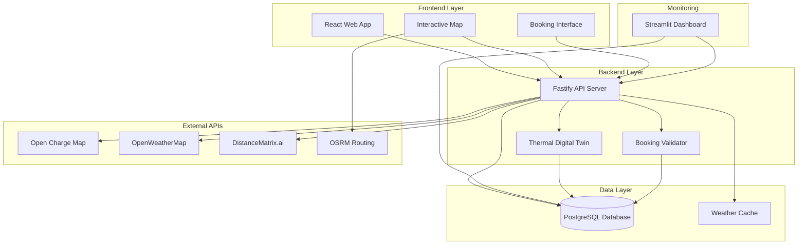

# Design Document: Transformer Sentinel Protocol

## Overview

The Transformer Sentinel Protocol is a grid-resilience middleware system that prevents distribution transformer failure through intelligent thermal management of EV charging loads. The system uses deterministic physics-based thermal modeling rather than AI predictions to ensure reliable grid stability assessments.

The core innovation is the Thermal Digital Twin - a real-time computational model that simulates transformer temperature based on current load, ambient conditions, and thermal physics according to the IEC 60076-7 standard. This enables proactive thermal capacity management rather than reactive overload protection.

## Architecture

The system follows a microservices architecture with three primary components:

### Frontend (React + Vite Web Application)
- **Purpose**: User-facing interface for station discovery and booking
- **Technology Stack**: React, Vite, Tailwind CSS, Leaflet.js, Zustand
- **Key Features**: Interactive map with grid health visualization, booking interface, thermal impact preview

### Backend (Fastify API Server)
- **Purpose**: Core Sentinel Engine with thermal calculations and orchestration
- **Technology Stack**: Fastify (Node.js), PostgreSQL database
- **Key Features**: Thermal Digital Twin, booking validation, external API integration

### Dashboard (Streamlit Technical Interface)
- **Purpose**: Real-time monitoring and system administration
- **Technology Stack**: Streamlit (Python)
- **Key Features**: Thermal data visualization, system health monitoring, simulation tools



## Components and Interfaces

### Thermal Digital Twin Engine

The core component implementing the IEC 60076-7 thermal model:

**Key Formula**: 
```
Δθ_TO = Δθ_TO,R × (K^n)
T_oil = T_ambient + Δθ_TO
```

Where:
- `Δθ_TO`: Top-oil temperature rise over ambient
- `Δθ_TO,R`: Rated temperature rise at full load
- `K`: Load factor (current load / rated load)
- `n`: Thermal exponent (typically 0.8-1.0)
- `T_ambient`: Current ambient temperature from weather API

**Interface**:
```typescript
interface ThermalEngine {
  calculateTemperature(
    currentLoad: number,
    ratedLoad: number,
    ambientTemp: number,
    ratedTempRise: number
  ): number;
  
  validateBooking(
    stationId: string,
    requestedLoad: number,
    timeWindow: TimeWindow
  ): ValidationResult;
  
  projectTemperature(
    stationId: string,
    futureLoads: LoadProfile[]
  ): TemperatureProjection;
}
```

### Station Discovery Service

Integrates multiple data sources to provide grid-aware station recommendations:

**Interface**:
```typescript
interface StationDiscovery {
  findNearbyStations(
    location: GeoPoint,
    radius: number,
    energyRequirement: number
  ): Promise<StationRecommendation[]>;
  
  calculateSlotScore(
    station: ChargingStation,
    userLocation: GeoPoint,
    thermalCapacity: number
  ): number;
}
```

**Slot Score Algorithm**:
```
SlotScore = (1 / distance_km) + (thermal_headroom / max_thermal_capacity)
```

### Booking Validation System

Ensures thermal constraints are respected during reservation:

**Interface**:
```typescript
interface BookingValidator {
  validateThermalCapacity(
    booking: BookingRequest
  ): Promise<ValidationResult>;
  
  suggestAlternatives(
    rejectedBooking: BookingRequest
  ): Promise<Alternative[]>;
  
  reserveThermalCapacity(
    confirmedBooking: Booking
  ): Promise<void>;
}
```

### External API Integration Layer

Manages data from multiple external sources with caching and fallback strategies:

**Open Charge Map Integration**:
- Endpoint: `https://api.openchargemap.io/v3/poi/`
- Data: Station locations, connector types, power ratings
- Caching: 24 hours for station metadata

**Weather Data Integration**:
- Endpoint: OpenWeatherMap Current Weather API
- Data: Ambient temperature for thermal calculations
- Caching: 30 minutes to minimize API calls

**Distance Calculation**:
- Service: DistanceMatrix.ai API
- Purpose: Driving distance and time calculations
- Fallback: Haversine distance formula

## Data Models

### Core Entities

**ChargingStation**:
```typescript
interface ChargingStation {
  id: string;
  location: GeoPoint;
  transformerRating: number; // kVA
  currentLoad: number; // kW
  ratedTempRise: number; // °C
  connectorTypes: ConnectorType[];
  operatorId: string;
  status: StationStatus;
}
```

**Booking**:
```typescript
interface Booking {
  id: string;
  stationId: string;
  userId: string;
  startTime: DateTime;
  endTime: DateTime;
  expectedEnergyKwh: number;
  expectedPowerKw: number;
  thermalReservation: ThermalReservation;
  status: BookingStatus;
}
```

**ThermalReservation**:
```typescript
interface ThermalReservation {
  stationId: string;
  reservedCapacity: number; // kW
  projectedTempRise: number; // °C
  safetyMargin: number; // °C
  validUntil: DateTime;
}
```

**GridMetrics**:
```typescript
interface GridMetrics {
  stationId: string;
  timestamp: DateTime;
  currentLoad: number; // kW
  projectedTemperature: number; // °C
  ambientTemperature: number; // °C
  gridHealthStatus: 'GREEN' | 'YELLOW' | 'RED';
  thermalHeadroom: number; // kW
}
```

### Database Schema

**PostgreSQL Tables**:

```sql
-- Charging stations with transformer specifications
CREATE TABLE stations (
  id UUID PRIMARY KEY DEFAULT gen_random_uuid(),
  latitude DECIMAL(10, 8) NOT NULL,
  longitude DECIMAL(11, 8) NOT NULL,
  transformer_rating_kva INTEGER NOT NULL,
  rated_temp_rise_c DECIMAL(5, 2) NOT NULL,
  operator_id TEXT,
  status TEXT DEFAULT 'OPERATIONAL',
  created_at TIMESTAMP WITH TIME ZONE DEFAULT CURRENT_TIMESTAMP
);

-- Create spatial index for geospatial queries
CREATE INDEX idx_stations_location ON stations USING GIST (
  ST_Point(longitude, latitude)
);

-- Active and historical bookings
CREATE TABLE bookings (
  id UUID PRIMARY KEY DEFAULT gen_random_uuid(),
  station_id UUID NOT NULL,
  user_id TEXT NOT NULL,
  start_time TIMESTAMP WITH TIME ZONE NOT NULL,
  end_time TIMESTAMP WITH TIME ZONE NOT NULL,
  expected_energy_kwh DECIMAL(8, 2) NOT NULL,
  expected_power_kw DECIMAL(8, 2) NOT NULL,
  status TEXT DEFAULT 'CONFIRMED',
  created_at TIMESTAMP WITH TIME ZONE DEFAULT CURRENT_TIMESTAMP,
  FOREIGN KEY (station_id) REFERENCES stations(id) ON DELETE CASCADE
);

-- Index for time-based booking queries
CREATE INDEX idx_bookings_time_range ON bookings (station_id, start_time, end_time);
CREATE INDEX idx_bookings_status ON bookings (status, created_at);

-- Time-series thermal and load data
CREATE TABLE grid_metrics (
  id BIGSERIAL PRIMARY KEY,
  station_id UUID NOT NULL,
  timestamp TIMESTAMP WITH TIME ZONE NOT NULL,
  current_load_kw DECIMAL(8, 2) NOT NULL,
  projected_temp_c DECIMAL(5, 2) NOT NULL,
  ambient_temp_c DECIMAL(5, 2) NOT NULL,
  grid_health_status TEXT NOT NULL CHECK (grid_health_status IN ('GREEN', 'YELLOW', 'RED')),
  thermal_headroom_kw DECIMAL(8, 2) NOT NULL,
  FOREIGN KEY (station_id) REFERENCES stations(id) ON DELETE CASCADE
);

-- Index for time-series queries
CREATE INDEX idx_grid_metrics_station_time ON grid_metrics (station_id, timestamp DESC);
CREATE INDEX idx_grid_metrics_health ON grid_metrics (grid_health_status, timestamp);

-- Cached weather data
CREATE TABLE weather_cache (
  location_key TEXT PRIMARY KEY,
  temperature_c DECIMAL(5, 2) NOT NULL,
  cached_at TIMESTAMP WITH TIME ZONE NOT NULL,
  expires_at TIMESTAMP WITH TIME ZONE NOT NULL
);

-- Index for weather cache cleanup
CREATE INDEX idx_weather_cache_expires ON weather_cache (expires_at);

-- Thermal reservations for booking validation
CREATE TABLE thermal_reservations (
  id UUID PRIMARY KEY DEFAULT gen_random_uuid(),
  station_id UUID NOT NULL,
  booking_id UUID NOT NULL,
  reserved_capacity_kw DECIMAL(8, 2) NOT NULL,
  projected_temp_rise_c DECIMAL(5, 2) NOT NULL,
  safety_margin_c DECIMAL(5, 2) NOT NULL,
  valid_from TIMESTAMP WITH TIME ZONE NOT NULL,
  valid_until TIMESTAMP WITH TIME ZONE NOT NULL,
  created_at TIMESTAMP WITH TIME ZONE DEFAULT CURRENT_TIMESTAMP,
  FOREIGN KEY (station_id) REFERENCES stations(id) ON DELETE CASCADE,
  FOREIGN KEY (booking_id) REFERENCES bookings(id) ON DELETE CASCADE
);

-- Index for thermal reservation queries
CREATE INDEX idx_thermal_reservations_station_time ON thermal_reservations (station_id, valid_from, valid_until);
```

## Correctness Properties

*A property is a characteristic or behavior that should hold true across all valid executions of a system-essentially, a formal statement about what the system should do. Properties serve as the bridge between human-readable specifications and machine-verifiable correctness guarantees.*

Before defining the correctness properties, I need to analyze the acceptance criteria from the requirements to determine which are testable as properties.

### Property 1: Station Discovery Distance Filtering
*For any* user location and energy requirement, all stations returned by the discovery service should be within a reasonable driving distance threshold based on the energy requirement and typical EV range.
**Validates: Requirements 1.1**

### Property 2: Grid Health Color Coding Consistency
*For any* charging station with calculated grid health status, the map interface should display the station marker with the correct color (Green for safe, Yellow for caution, Red for critical) corresponding to its thermal status.
**Validates: Requirements 1.2, 5.2**

### Property 3: Thermal Model Deterministic Calculation
*For any* set of input parameters (current load, ambient temperature, existing bookings), the Thermal Digital Twin should always produce the same temperature calculation using the Top-Oil Temperature Model, ensuring deterministic physics-based results.
**Validates: Requirements 1.3, 2.4**

### Property 4: Critical Temperature Status Assignment
*For any* station where the projected transformer temperature exceeds 110°C, the system should always mark it with Red grid health status and deprioritize it in station recommendations.
**Validates: Requirements 1.4**

### Property 5: Slot Score Ranking Consistency
*For any* set of available charging stations, the ranking should always follow the Slot Score formula combining distance and thermal availability, with higher scores indicating better recommendations.
**Validates: Requirements 1.5**

### Property 6: Thermal Impact Simulation Completeness
*For any* booking request, the thermal simulation should always include both the existing load profile and the new requested load when calculating projected transformer temperature.
**Validates: Requirements 2.1**

### Property 7: Unsafe Booking Rejection with Alternatives
*For any* booking request that would cause transformer temperature to exceed safe limits, the system should reject the request with a 409 Conflict status and provide alternative suggestions (different stations, times, or power levels).
**Validates: Requirements 2.2, 4.1, 4.2, 4.3, 4.4**

### Property 8: Thermal Capacity Reservation Consistency
*For any* confirmed booking, the system should always reserve the corresponding thermal capacity in the Thermal Digital Twin and reflect this reservation in all subsequent thermal calculations.
**Validates: Requirements 2.3, 6.5**

### Property 9: Weather-Based Thermal Recalculation
*For any* change in ambient temperature, all thermal projections for all stations should be recalculated using the updated weather data to maintain accuracy.
**Validates: Requirements 2.5**

### Property 10: Comprehensive Data Persistence
*For any* system operation (station data, booking creation, thermal calculation), all required data fields should be persisted to the database with complete information and proper relationships.
**Validates: Requirements 8.1, 8.2, 8.3**

### Property 11: Thermal Capacity Double-Booking Prevention
*For any* overlapping time periods at the same station, the system should prevent multiple bookings from reserving the same thermal capacity, ensuring no double-booking of transformer load capacity.
**Validates: Requirements 6.4**

### Property 12: Booking Cancellation Capacity Release
*For any* cancelled booking, the system should immediately release all reserved thermal capacity, making it available for new booking requests.
**Validates: Requirements 6.5**

### Property 13: Concurrent Operation Data Integrity
*For any* set of concurrent booking requests targeting the same station, the system should maintain data consistency and prevent race conditions through proper transaction handling.
**Validates: Requirements 8.4, 10.4**

### Property 14: Fallback Behavior with Cached Data
*For any* external API failure, the system should use cached data when available and provide clear degraded service notifications to users.
**Validates: Requirements 7.4**

### Property 15: System Component Failure Graceful Degradation
*For any* system component failure, the system should provide graceful degradation of functionality and clear error messages rather than complete system failure.
**Validates: Requirements 10.5**

## Error Handling

The system implements comprehensive error handling across all components:

### Thermal Calculation Errors
- **Invalid Input Data**: Return default safe values and log warnings
- **Missing Weather Data**: Use cached values or regional averages
- **Calculation Overflow**: Apply safety limits and alert operators

### External API Failures
- **Open Charge Map Unavailable**: Use cached station data with staleness indicators
- **Weather API Timeout**: Use last known temperature with degraded accuracy warnings
- **Distance API Failure**: Fall back to Haversine distance calculations

### Database Errors
- **Connection Failures**: Implement connection pooling and retry logic
- **Transaction Conflicts**: Use optimistic locking with retry mechanisms
- **Data Corruption**: Validate data integrity on read operations

### User Interface Errors
- **Network Connectivity**: Provide offline mode with cached data
- **Invalid User Input**: Client-side validation with clear error messages
- **Session Timeout**: Graceful re-authentication flow

## Testing Strategy

The system employs a dual testing approach combining unit tests for specific scenarios and property-based tests for comprehensive validation:

### Property-Based Testing
- **Framework**: fast-check (JavaScript) for comprehensive input coverage
- **Configuration**: Minimum 100 iterations per property test to ensure statistical confidence
- **Coverage**: Each correctness property implemented as a separate property-based test
- **Tagging**: Each test tagged with format: **Feature: transformer-sentinel-protocol, Property {number}: {property_text}**

### Unit Testing
- **Framework**: Jest for JavaScript/TypeScript components
- **Focus Areas**: 
  - Specific thermal calculation examples with known inputs/outputs
  - Edge cases like extreme temperatures or zero loads
  - Integration points between components
  - Error conditions and fallback behaviors
- **Coverage**: Target 90% code coverage for core business logic

### Integration Testing
- **API Testing**: Validate end-to-end booking flows with real database
- **External Service Mocking**: Test fallback behaviors when APIs are unavailable
- **Database Testing**: Verify ACID properties and concurrent operation handling
- **Performance Testing**: Validate response time requirements under load

### Testing Configuration
Property-based tests must run with minimum 100 iterations to account for randomization and provide statistical confidence in the results. Each property test must reference its corresponding design document property using the tag format specified above.

The testing strategy ensures both concrete validation through unit tests and comprehensive correctness verification through property-based testing, providing confidence in system reliability and correctness.

## Requirements to Design Mapping

This section maps each requirement from the requirements document to specific design components and implementation details:

### Requirement 1: Station Discovery and Grid Health Analysis
- **Design Components**: Station Discovery Service, Thermal Digital Twin Engine, External API Integration Layer
- **Database Tables**: stations, grid_metrics, weather_cache
- **Key Interfaces**: StationDiscovery.findNearbyStations(), ThermalEngine.calculateTemperature()
- **Properties Validated**: Property 1 (Distance Filtering), Property 2 (Color Coding), Property 3 (Deterministic Calculation), Property 4 (Critical Temperature Status), Property 5 (Slot Score Ranking)

### Requirement 2: Thermal Capacity Reservation System
- **Design Components**: Booking Validation System, Thermal Digital Twin Engine
- **Database Tables**: bookings, thermal_reservations, grid_metrics
- **Key Interfaces**: BookingValidator.validateThermalCapacity(), ThermalEngine.validateBooking()
- **Properties Validated**: Property 6 (Thermal Impact Simulation), Property 7 (Unsafe Booking Rejection), Property 8 (Thermal Capacity Reservation), Property 9 (Weather-Based Recalculation)

### Requirement 3: Real-time Transformer Temperature Monitoring
- **Design Components**: Streamlit Dashboard, Thermal Digital Twin Engine
- **Database Tables**: grid_metrics, stations
- **Key Interfaces**: ThermalEngine.projectTemperature(), Dashboard real-time visualization
- **Properties Validated**: Property 3 (Deterministic Calculation), Property 9 (Weather-Based Recalculation)

### Requirement 4: Conflict Detection and Alternative Suggestions
- **Design Components**: Booking Validation System, Station Discovery Service
- **Database Tables**: bookings, stations, thermal_reservations
- **Key Interfaces**: BookingValidator.suggestAlternatives(), StationDiscovery.findNearbyStations()
- **Properties Validated**: Property 7 (Unsafe Booking Rejection with Alternatives)

### Requirement 5: Interactive Map with Grid-Aware Visualization
- **Design Components**: React Frontend, External API Integration (OSRM)
- **Database Tables**: stations, grid_metrics
- **Key Interfaces**: Frontend Map Component, Real-time WebSocket updates
- **Properties Validated**: Property 2 (Grid Health Color Coding)

### Requirement 6: Booking System with Thermal Validation
- **Design Components**: Booking Validation System, PostgreSQL Database
- **Database Tables**: bookings, thermal_reservations, stations
- **Key Interfaces**: BookingValidator.validateThermalCapacity(), BookingValidator.reserveThermalCapacity()
- **Properties Validated**: Property 8 (Thermal Capacity Reservation), Property 11 (Double-Booking Prevention), Property 12 (Cancellation Capacity Release)

### Requirement 7: Data Integration and External API Management
- **Design Components**: External API Integration Layer
- **Database Tables**: weather_cache, stations
- **Key Interfaces**: Weather API client, Open Charge Map client, DistanceMatrix client
- **Properties Validated**: Property 14 (Fallback Behavior with Cached Data)

### Requirement 8: Database Management and Data Persistence
- **Design Components**: PostgreSQL Database Schema, Connection Management
- **Database Tables**: All tables (stations, bookings, grid_metrics, weather_cache, thermal_reservations)
- **Key Interfaces**: Database connection pool, Transaction management
- **Properties Validated**: Property 10 (Comprehensive Data Persistence), Property 13 (Concurrent Operation Data Integrity)

### Requirement 9: Technical Dashboard for System Monitoring
- **Design Components**: Streamlit Dashboard
- **Database Tables**: grid_metrics, bookings, stations
- **Key Interfaces**: Dashboard visualization components, Real-time data streaming
- **Properties Validated**: Property 3 (Deterministic Calculation), Property 9 (Weather-Based Recalculation)

### Requirement 10: System Performance and Reliability
- **Design Components**: All system components with error handling and performance optimization
- **Database Tables**: All tables with proper indexing
- **Key Interfaces**: All interfaces with timeout and retry logic
- **Properties Validated**: Property 13 (Concurrent Operation Data Integrity), Property 15 (Graceful Degradation)

## Task to Design Component Mapping

This section maps each task from the tasks document to the corresponding design components:

### Tasks 1-2: Project Setup and Database
- **Design Components**: PostgreSQL Database Schema, Connection Management
- **Database Tables**: All tables with proper indexing and constraints
- **Implementation Focus**: Database setup, connection pooling, migration system

### Tasks 3: Core API Endpoints
- **Design Components**: Station Discovery Service, Booking Validation System, Thermal Digital Twin Engine
- **Database Tables**: stations, bookings, grid_metrics, thermal_reservations
- **Implementation Focus**: REST API endpoints with thermal validation logic

### Task 4: External API Integrations
- **Design Components**: External API Integration Layer
- **Database Tables**: weather_cache, stations
- **Implementation Focus**: API clients with caching and fallback strategies

### Tasks 5-6: Frontend Development and State Management
- **Design Components**: React Frontend with Interactive Map
- **Database Tables**: stations, bookings, grid_metrics (via API)
- **Implementation Focus**: User interface with real-time grid health visualization

### Task 7: Dashboard Development
- **Design Components**: Streamlit Dashboard
- **Database Tables**: grid_metrics, bookings, stations
- **Implementation Focus**: Technical monitoring interface with real-time data

### Tasks 8-10: Testing, Optimization, and Demo Preparation
- **Design Components**: All components with comprehensive testing
- **Database Tables**: All tables with performance optimization
- **Implementation Focus**: Property-based testing, performance tuning, demo scenarios

This mapping ensures that every requirement is addressed by specific design components, implemented through targeted tasks, and validated by corresponding correctness properties. The PostgreSQL database provides the foundation for all data persistence needs with proper indexing, constraints, and ACID compliance.