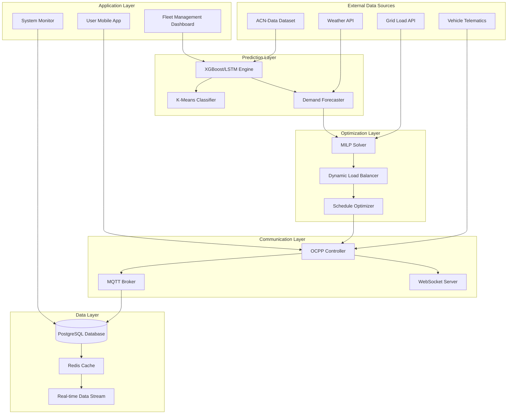

# Design Document: Transformer Sentinel Protocol

## Overview

The Transformer Sentinel Protocol is a software-based "Operating System" for EV charging infrastructure that treats grid management as a distributed computing problem. The system uses machine learning for demand prediction, optimization algorithms for dynamic load balancing, and real-time communication protocols to prevent transformer overload while maximizing user convenience and infrastructure utilization.

The core innovation is treating charging infrastructure as a distributed computing system where software makes intelligent decisions based on data. The system implements three key layers: Prediction Layer (ML-based forecasting), Optimization Layer (MILP-based load balancing), and Communication Layer (OCPP protocol control).

## Architecture

The system follows a layered software architecture with four primary layers:

### Prediction Layer (Machine Learning Engine)
- **Purpose**: Forecasts 24-hour power demand using historical patterns
- **Technology Stack**: Python, XGBoost/LSTM, scikit-learn, pandas
- **Key Features**: Time-series analysis, user classification (K-Means), demand forecasting

### Optimization Layer (Dynamic Load Balancer)
- **Purpose**: Solves Mixed-Integer Linear Programming problems for optimal power distribution
- **Technology Stack**: Python, PuLP/Gurobi, NumPy
- **Key Features**: MILP solver, constraint optimization, peak shaving algorithms

### Communication Layer (OCPP Controller)
- **Purpose**: Real-time communication with charging hardware via OCPP 1.6/2.0
- **Technology Stack**: Node.js, WebSocket, MQTT
- **Key Features**: SetChargingProfile commands, real-time monitoring, protocol management

### Application Layer (Fleet Management Dashboard)
- **Purpose**: User interfaces and system monitoring
- **Technology Stack**: React, Streamlit, PostgreSQL
- **Key Features**: User notifications, system monitoring, heuristic recommendations



## Components and Interfaces

### Prediction Engine (Machine Learning Layer)

The core ML component that learns from historical data to predict future demand:

**XGBoost Demand Forecaster**:
```python
class DemandForecaster:
    def __init__(self):
        self.model = XGBRegressor(
            n_estimators=100,
            max_depth=6,
            learning_rate=0.1
        )
        
    def train(self, historical_data: pd.DataFrame):
        """Train on ACN-Data format: timestamp, duration, energy, temperature, price"""
        features = self.extract_features(historical_data)
        self.model.fit(features, historical_data['power_demand'])
        
    def predict_24h(self, current_time: datetime) -> np.array:
        """Predict power demand P(t) for next 24 hours"""
        future_features = self.generate_future_features(current_time)
        return self.model.predict(future_features)
        
    def extract_features(self, data: pd.DataFrame) -> pd.DataFrame:
        """Extract time-series features: hour, day_of_week, temperature, etc."""
        return pd.DataFrame({
            'hour': data['timestamp'].dt.hour,
            'day_of_week': data['timestamp'].dt.dayofweek,
            'temperature': data['temperature'],
            'electricity_price': data['price'],
            'historical_avg': data['power_demand'].rolling(24).mean()
        })
```

**K-Means User Classifier**:
```python
class UserClassifier:
    def __init__(self):
        self.kmeans = KMeans(n_clusters=3)  # Commuters, Fleet, Occasional
        
    def classify_users(self, charging_sessions: pd.DataFrame) -> pd.DataFrame:
        """Group users by behavior patterns"""
        features = pd.DataFrame({
            'avg_arrival_hour': charging_sessions.groupby('user_id')['arrival_time'].dt.hour.mean(),
            'avg_duration': charging_sessions.groupby('user_id')['duration'].mean(),
            'weekly_frequency': charging_sessions.groupby('user_id').size() / 52,
            'energy_consistency': charging_sessions.groupby('user_id')['energy_kwh'].std()
        })
        
        clusters = self.kmeans.fit_predict(features)
        return pd.DataFrame({
            'user_id': features.index,
            'user_type': ['Commuter' if c == 0 else 'Fleet' if c == 1 else 'Occasional' for c in clusters]
        })
```

### Dynamic Load Balancer (Optimization Layer)

MILP-based optimizer that distributes power optimally:

**Interface**:
```python
class DynamicLoadBalancer:
    def __init__(self, transformer_limit_kw: float):
        self.transformer_limit = transformer_limit_kw
        self.solver = pulp.PULP_CBC_CMD(msg=0)
        
    def optimize_charging_schedule(
        self, 
        connected_evs: List[EVSession],
        predicted_demand: np.array,
        time_horizon_hours: int = 24
    ) -> ChargingSchedule:
        """
        Solve MILP problem:
        Minimize: max(total_power_t) for all t
        Subject to: 
        - Sum(power_t) <= transformer_limit for all t
        - Each EV reaches target SOC by departure time
        - Power constraints per EV
        """
        
        # Decision variables: power allocation per EV per time slot
        power_vars = {}
        for ev in connected_evs:
            for t in range(time_horizon_hours):
                power_vars[(ev.id, t)] = pulp.LpVariable(
                    f"power_{ev.id}_{t}", 
                    lowBound=0, 
                    upBound=ev.max_power_kw
                )
        
        # Objective: minimize peak power
        peak_power = pulp.LpVariable("peak_power", lowBound=0)
        problem = pulp.LpProblem("LoadBalancing", pulp.LpMinimize)
        problem += peak_power
        
        # Constraints
        for t in range(time_horizon_hours):
            # Grid constraint
            total_power_t = sum(power_vars[(ev.id, t)] for ev in connected_evs)
            problem += total_power_t <= self.transformer_limit
            problem += total_power_t <= peak_power
            
        # EV energy constraints
        for ev in connected_evs:
            departure_slot = min(ev.departure_time_hours, time_horizon_hours)
            total_energy = sum(power_vars[(ev.id, t)] for t in range(departure_slot))
            problem += total_energy >= ev.required_energy_kwh
            
        problem.solve(self.solver)
        return self.extract_schedule(power_vars, connected_evs)
```

### OCPP Controller (Communication Layer)

Real-time communication with charging hardware:

**Interface**:
```typescript
interface OCPPController {
  sendChargingProfile(
    chargerId: string,
    profile: ChargingProfile
  ): Promise<OCPPResponse>;
  
  monitorChargerStatus(
    chargerId: string
  ): Observable<ChargerStatus>;
  
  handleStartTransaction(
    chargerId: string,
    connectorId: number,
    idTag: string
  ): Promise<void>;
  
  handleStopTransaction(
    transactionId: number,
    meterStop: number
  ): Promise<void>;
}

interface ChargingProfile {
  chargingProfileId: number;
  stackLevel: number;
  chargingProfilePurpose: 'TxDefaultProfile' | 'TxProfile';
  chargingProfileKind: 'Absolute' | 'Recurring' | 'Relative';
  chargingSchedule: {
    duration?: number;
    startSchedule?: string;
    chargingRateUnit: 'W' | 'A';
    chargingSchedulePeriod: Array<{
      startPeriod: number;
      limit: number;
      numberPhases?: number;
    }>;
  };
}
```

**OCPP Message Flow**:
```typescript
class OCPPMessageHandler {
  async handleOptimizationResult(schedule: ChargingSchedule): Promise<void> {
    for (const evSchedule of schedule.evSchedules) {
      const profile: ChargingProfile = {
        chargingProfileId: evSchedule.profileId,
        stackLevel: 1,
        chargingProfilePurpose: 'TxProfile',
        chargingProfileKind: 'Absolute',
        chargingSchedule: {
          chargingRateUnit: 'W',
          chargingSchedulePeriod: evSchedule.powerLimits.map((limit, index) => ({
            startPeriod: index * 3600, // 1-hour periods
            limit: limit * 1000 // Convert kW to W
          }))
        }
      };
      
      await this.ocppController.sendChargingProfile(evSchedule.chargerId, profile);
    }
  }
  
  async notifyUser(userId: string, message: string): Promise<void> {
    // Send push notification: "Your charging speed is reduced to save the grid, 
    // but you will still be 100% full by 8:00 AM."
    await this.pushNotificationService.send(userId, {
      title: "Smart Charging Active",
      body: message,
      type: "grid_optimization"
    });
  }
}
```

### Fleet Management Dashboard

Heuristic search system for optimal recommendations:

**Interface**:
```typescript
interface FleetManagementDashboard {
  suggestOptimalArrivalTime(
    userId: string,
    preferredTime: DateTime,
    energyRequired: number
  ): Promise<ArrivalSuggestion>;
  
  recommendNearbyStations(
    location: GeoPoint,
    energyRequired: number,
    timeConstraints: TimeWindow
  ): Promise<StationRecommendation[]>;
  
  getSystemMetrics(): Promise<SystemMetrics>;
}

interface ArrivalSuggestion {
  suggestedTime: DateTime;
  reasonCode: 'PEAK_AVOIDANCE' | 'COST_OPTIMIZATION' | 'GRID_STABILITY';
  estimatedSavings: {
    cost: number;
    time: number;
    gridImpact: number;
  };
  alternativeOptions: Array<{
    time: DateTime;
    tradeoffs: string;
  }>;
}
```

## Data Models

### Core Entities

**ChargingSession** (ACN-Data Format):
```typescript
interface ChargingSession {
  sessionId: string;
  userId: string;
  stationId: string;
  timestamp: DateTime; // When plug was inserted
  connectionDuration: number; // Hours
  energyDelivered: number; // kWh
  peakPower: number; // kW
  temperature: number; // °C (affects battery speed)
  electricityPrice: number; // $/kWh
  userType: 'Commuter' | 'Fleet' | 'Occasional';
}
```

**EVSession** (Real-time Active Session):
```typescript
interface EVSession {
  id: string;
  chargerId: string;
  connectorId: number;
  userId: string;
  currentSOC: number; // %
  targetSOC: number; // %
  requiredEnergyKwh: number;
  maxPowerKw: number;
  arrivalTime: DateTime;
  departureTime: DateTime;
  isFlexible: boolean; // Can accept reduced charging speed
  priorityLevel: 'LOW' | 'MEDIUM' | 'HIGH';
}
```

**ChargingSchedule** (Optimization Output):
```typescript
interface ChargingSchedule {
  scheduleId: string;
  generatedAt: DateTime;
  validUntil: DateTime;
  totalPeakReduction: number; // kW
  evSchedules: Array<{
    evSessionId: string;
    chargerId: string;
    profileId: number;
    powerLimits: number[]; // kW per hour for next 24 hours
    estimatedCompletionTime: DateTime;
    userNotification: string;
  }>;
  gridMetrics: {
    predictedPeakLoad: number;
    transformerUtilization: number;
    costSavings: number;
  };
}
```

**GridSignal** (Real-time Grid Data):
```typescript
interface GridSignal {
  timestamp: DateTime;
  transformerId: string;
  currentLoadKw: number;
  capacityLimitKw: number;
  utilizationPercent: number;
  priceSignal: number; // $/kWh
  stabilityIndex: number; // 0-1 (1 = stable)
  demandResponseActive: boolean;
}
```

**UserProfile** (ML Classification Output):
```typescript
interface UserProfile {
  userId: string;
  userType: 'Commuter' | 'Fleet' | 'Occasional';
  behaviorMetrics: {
    avgArrivalHour: number;
    avgSessionDuration: number;
    weeklyFrequency: number;
    energyConsistency: number;
    priceElasticity: number;
  };
  preferences: {
    acceptsDelayedCharging: boolean;
    maxAcceptableDelay: number; // minutes
    costSensitive: boolean;
    environmentallyConscious: boolean;
  };
  lastUpdated: DateTime;
}
```

### Database Schema

**PostgreSQL Tables for Software-Based Approach**:

```sql
-- Historical charging sessions for ML training (ACN-Data format)
CREATE TABLE charging_sessions (
  session_id UUID PRIMARY KEY DEFAULT gen_random_uuid(),
  user_id TEXT NOT NULL,
  station_id UUID NOT NULL,
  timestamp TIMESTAMP WITH TIME ZONE NOT NULL,
  connection_duration_hours DECIMAL(8, 2) NOT NULL,
  energy_delivered_kwh DECIMAL(8, 2) NOT NULL,
  peak_power_kw DECIMAL(8, 2) NOT NULL,
  temperature_c DECIMAL(5, 2) NOT NULL,
  electricity_price DECIMAL(8, 4) NOT NULL,
  user_type TEXT CHECK (user_type IN ('Commuter', 'Fleet', 'Occasional')),
  created_at TIMESTAMP WITH TIME ZONE DEFAULT CURRENT_TIMESTAMP
);

-- Index for time-series ML queries
CREATE INDEX idx_charging_sessions_timestamp ON charging_sessions (timestamp DESC);
CREATE INDEX idx_charging_sessions_user_type ON charging_sessions (user_type, timestamp);

-- Active EV charging sessions for real-time optimization
CREATE TABLE active_ev_sessions (
  session_id UUID PRIMARY KEY DEFAULT gen_random_uuid(),
  charger_id TEXT NOT NULL,
  connector_id INTEGER NOT NULL,
  user_id TEXT NOT NULL,
  current_soc_percent INTEGER NOT NULL,
  target_soc_percent INTEGER NOT NULL,
  required_energy_kwh DECIMAL(8, 2) NOT NULL,
  max_power_kw DECIMAL(8, 2) NOT NULL,
  arrival_time TIMESTAMP WITH TIME ZONE NOT NULL,
  departure_time TIMESTAMP WITH TIME ZONE NOT NULL,
  is_flexible BOOLEAN DEFAULT true,
  priority_level TEXT DEFAULT 'MEDIUM' CHECK (priority_level IN ('LOW', 'MEDIUM', 'HIGH')),
  created_at TIMESTAMP WITH TIME ZONE DEFAULT CURRENT_TIMESTAMP
);

-- Index for optimization queries
CREATE INDEX idx_active_sessions_departure ON active_ev_sessions (departure_time);
CREATE INDEX idx_active_sessions_charger ON active_ev_sessions (charger_id, arrival_time);

-- ML model predictions and forecasts
CREATE TABLE demand_forecasts (
  forecast_id UUID PRIMARY KEY DEFAULT gen_random_uuid(),
  transformer_id TEXT NOT NULL,
  forecast_timestamp TIMESTAMP WITH TIME ZONE NOT NULL,
  prediction_horizon_hours INTEGER NOT NULL,
  predicted_demand_kw DECIMAL(8, 2) NOT NULL,
  confidence_interval_lower DECIMAL(8, 2),
  confidence_interval_upper DECIMAL(8, 2),
  model_version TEXT NOT NULL,
  created_at TIMESTAMP WITH TIME ZONE DEFAULT CURRENT_TIMESTAMP
);

-- Index for forecast queries
CREATE INDEX idx_demand_forecasts_time ON demand_forecasts (transformer_id, forecast_timestamp);

-- MILP optimization results and charging schedules
CREATE TABLE charging_schedules (
  schedule_id UUID PRIMARY KEY DEFAULT gen_random_uuid(),
  transformer_id TEXT NOT NULL,
  generated_at TIMESTAMP WITH TIME ZONE NOT NULL,
  valid_until TIMESTAMP WITH TIME ZONE NOT NULL,
  total_peak_reduction_kw DECIMAL(8, 2) NOT NULL,
  predicted_peak_load_kw DECIMAL(8, 2) NOT NULL,
  transformer_utilization_percent DECIMAL(5, 2) NOT NULL,
  cost_savings_usd DECIMAL(10, 2),
  optimization_status TEXT DEFAULT 'OPTIMAL',
  solver_time_seconds DECIMAL(8, 3),
  created_at TIMESTAMP WITH TIME ZONE DEFAULT CURRENT_TIMESTAMP
);

-- Individual EV power profiles from MILP solution
CREATE TABLE ev_power_profiles (
  profile_id UUID PRIMARY KEY DEFAULT gen_random_uuid(),
  schedule_id UUID NOT NULL,
  ev_session_id UUID NOT NULL,
  charger_id TEXT NOT NULL,
  ocpp_profile_id INTEGER NOT NULL,
  time_slot INTEGER NOT NULL, -- Hour offset from schedule start
  power_limit_kw DECIMAL(8, 2) NOT NULL,
  estimated_completion_time TIMESTAMP WITH TIME ZONE,
  user_notification TEXT,
  FOREIGN KEY (schedule_id) REFERENCES charging_schedules(id) ON DELETE CASCADE,
  FOREIGN KEY (ev_session_id) REFERENCES active_ev_sessions(session_id) ON DELETE CASCADE
);

-- Index for OCPP profile queries
CREATE INDEX idx_ev_power_profiles_charger ON ev_power_profiles (charger_id, time_slot);
CREATE INDEX idx_ev_power_profiles_schedule ON ev_power_profiles (schedule_id, time_slot);

-- Real-time grid signals and transformer data
CREATE TABLE grid_signals (
  signal_id BIGSERIAL PRIMARY KEY,
  transformer_id TEXT NOT NULL,
  timestamp TIMESTAMP WITH TIME ZONE NOT NULL,
  current_load_kw DECIMAL(8, 2) NOT NULL,
  capacity_limit_kw DECIMAL(8, 2) NOT NULL,
  utilization_percent DECIMAL(5, 2) NOT NULL,
  price_signal_usd_per_kwh DECIMAL(8, 4) NOT NULL,
  stability_index DECIMAL(3, 2) NOT NULL CHECK (stability_index >= 0 AND stability_index <= 1),
  demand_response_active BOOLEAN DEFAULT false,
  created_at TIMESTAMP WITH TIME ZONE DEFAULT CURRENT_TIMESTAMP
);

-- Index for real-time grid monitoring
CREATE INDEX idx_grid_signals_transformer_time ON grid_signals (transformer_id, timestamp DESC);
CREATE INDEX idx_grid_signals_utilization ON grid_signals (utilization_percent DESC, timestamp);

-- User behavior profiles from K-Means clustering
CREATE TABLE user_profiles (
  user_id TEXT PRIMARY KEY,
  user_type TEXT NOT NULL CHECK (user_type IN ('Commuter', 'Fleet', 'Occasional')),
  avg_arrival_hour DECIMAL(4, 2),
  avg_session_duration_hours DECIMAL(6, 2),
  weekly_frequency DECIMAL(4, 2),
  energy_consistency DECIMAL(6, 2),
  price_elasticity DECIMAL(4, 2),
  accepts_delayed_charging BOOLEAN DEFAULT true,
  max_acceptable_delay_minutes INTEGER DEFAULT 60,
  cost_sensitive BOOLEAN DEFAULT false,
  environmentally_conscious BOOLEAN DEFAULT false,
  last_updated TIMESTAMP WITH TIME ZONE DEFAULT CURRENT_TIMESTAMP
);

-- OCPP message log for debugging and compliance
CREATE TABLE ocpp_messages (
  message_id BIGSERIAL PRIMARY KEY,
  charger_id TEXT NOT NULL,
  message_type TEXT NOT NULL,
  action TEXT NOT NULL,
  payload JSONB NOT NULL,
  response JSONB,
  status TEXT DEFAULT 'SENT',
  timestamp TIMESTAMP WITH TIME ZONE DEFAULT CURRENT_TIMESTAMP
);

-- Index for OCPP message queries
CREATE INDEX idx_ocpp_messages_charger_time ON ocpp_messages (charger_id, timestamp DESC);
CREATE INDEX idx_ocpp_messages_action ON ocpp_messages (action, timestamp);
```

## Software Workflow

The system implements a continuous Monitor → Predict → Optimize → Execute → Notify cycle:

### 1. Monitor Phase
- **OCPP Controller** listens to charger status via WebSocket connections
- **Grid Signal Monitor** receives real-time transformer load data via MQTT
- **Vehicle Telematics** provides SOC and departure time updates
- All data streams into PostgreSQL for persistence and Redis for real-time access

### 2. Predict Phase  
- **XGBoost/LSTM Engine** analyzes historical patterns every 15 minutes
- Generates 24-hour demand forecast: `P(t) = f(hour, day_of_week, temperature, price, historical_avg)`
- **K-Means Classifier** updates user behavior profiles weekly
- Confidence intervals calculated for prediction uncertainty

### 3. Optimize Phase
- **MILP Solver** runs every 30 minutes or when new EVs connect
- **Objective**: Minimize peak power draw while meeting all departure constraints
- **Constraints**: 
  - `Sum(power_t) <= transformer_limit` for all time slots
  - `Sum(energy_delivered) >= required_energy` for each EV
  - `power_t <= max_charger_power` for each EV
- **Output**: Optimal power allocation schedule for next 24 hours

### 4. Execute Phase
- **OCPP Controller** sends `SetChargingProfile` commands to chargers
- Each command specifies power limits per hour: `"limit": 7000W for next 20 minutes"`
- **Real-time Monitoring** tracks actual vs. planned power consumption
- **Adaptive Control** adjusts profiles if conditions change

### 5. Notify Phase
- **Push Notifications** inform users of charging speed changes
- **Example Message**: "Your charging speed is reduced to save the grid, but you will still be 100% full by 8:00 AM."
- **Fleet Dashboard** shows system-wide optimization results
- **Cost/Environmental Impact** reporting for user engagement

```python
# Example Workflow Implementation
class ChargingOS:
    def __init__(self):
        self.predictor = DemandForecaster()
        self.optimizer = DynamicLoadBalancer(transformer_limit_kw=500)
        self.ocpp_controller = OCPPController()
        self.notification_service = NotificationService()
        
    async def run_optimization_cycle(self):
        """Main workflow loop - runs every 30 minutes"""
        
        # 1. Monitor: Get current state
        active_sessions = await self.get_active_ev_sessions()
        grid_signals = await self.get_current_grid_signals()
        
        # 2. Predict: Forecast next 24 hours
        demand_forecast = self.predictor.predict_24h(datetime.now())
        
        # 3. Optimize: Solve MILP problem
        schedule = self.optimizer.optimize_charging_schedule(
            connected_evs=active_sessions,
            predicted_demand=demand_forecast,
            current_grid_load=grid_signals.current_load_kw
        )
        
        # 4. Execute: Send OCPP commands
        for ev_schedule in schedule.ev_schedules:
            profile = self.create_ocpp_profile(ev_schedule)
            await self.ocpp_controller.sendChargingProfile(
                ev_schedule.charger_id, 
                profile
            )
            
        # 5. Notify: Update users
        for ev_schedule in schedule.ev_schedules:
            if ev_schedule.power_reduced:
                await self.notification_service.notify_user(
                    ev_schedule.user_id,
                    f"Smart charging active. You'll be {ev_schedule.target_soc}% charged by {ev_schedule.completion_time}"
                )
                
        # Save results for monitoring
        await self.save_schedule_results(schedule)
```

## Error Handling and Resilience

The system implements comprehensive error handling across all software layers:

### Machine Learning Pipeline Errors
- **Training Data Issues**: Handle missing values, outliers, and data quality problems
- **Model Prediction Failures**: Fallback to historical averages or simple heuristics
- **Feature Engineering Errors**: Robust feature extraction with default values
- **Model Drift Detection**: Automatic retraining triggers when accuracy degrades

### Optimization Solver Errors
- **Infeasible MILP Problems**: Constraint relaxation and alternative objective functions
- **Solver Timeout**: Suboptimal solution acceptance with time limits
- **Memory/Resource Limits**: Problem decomposition and rolling horizon approaches
- **Numerical Instability**: Solver parameter tuning and problem reformulation

### OCPP Communication Errors
- **Charger Disconnection**: Automatic reconnection and message queuing
- **Protocol Violations**: Message validation and error recovery procedures
- **Network Latency**: Timeout handling and retry mechanisms
- **Command Rejection**: Alternative charging profiles and manual override options

### Real-time Data Stream Errors
- **MQTT Broker Failures**: Message persistence and alternative data sources
- **Grid Signal Interruption**: Cached data usage and degraded operation modes
- **Vehicle Telematics Loss**: User input fallbacks and estimation algorithms
- **Database Connection Issues**: Connection pooling, failover, and data buffering

## Testing Strategy

The system employs a comprehensive testing approach combining unit tests, integration tests, and end-to-end validation:

### Machine Learning Model Testing
- **Framework**: pytest with scikit-learn testing utilities
- **Cross-Validation**: Time-series split validation for demand forecasting
- **Model Performance**: MAE, RMSE, MAPE metrics for prediction accuracy
- **A/B Testing**: Comparative analysis between XGBoost and LSTM models
- **Data Quality**: Automated data validation and anomaly detection

### Optimization Algorithm Testing
- **Framework**: pytest with PuLP/Gurobi test scenarios
- **Constraint Validation**: Verify all MILP constraints are satisfied
- **Optimality Testing**: Compare solutions against known optimal benchmarks
- **Stress Testing**: High-load scenarios with many concurrent EVs
- **Performance Testing**: Solver time and memory usage optimization

### OCPP Protocol Testing
- **Framework**: Jest/Mocha for Node.js WebSocket testing
- **Protocol Compliance**: OCPP 1.6/2.0 specification conformance testing
- **Message Validation**: JSON schema validation for all OCPP messages
- **Connection Testing**: Network failure and reconnection scenarios
- **Load Testing**: Concurrent charger communication stress testing

### End-to-End System Testing
- **Workflow Testing**: Complete Monitor → Predict → Optimize → Execute → Notify cycle
- **Integration Testing**: All system components working together
- **Performance Testing**: Response time and throughput under load
- **Reliability Testing**: System uptime and failure recovery validation
- **User Acceptance Testing**: Real-world scenario validation with actual users

### Property-Based Testing
- **Framework**: Hypothesis (Python) and fast-check (JavaScript)
- **ML Properties**: Prediction consistency and boundary condition testing
- **Optimization Properties**: Constraint satisfaction and solution feasibility
- **OCPP Properties**: Message format and protocol state consistency
- **Data Properties**: Database integrity and consistency validation

## Requirements to Design Mapping

This section maps each requirement from the requirements document to specific design components and implementation details:

### Requirement 1: Station Discovery and Grid Health Analysis
- **Design Components**: Station Discovery Service, Thermal Digital Twin Engine, External API Integration Layer
- **Database Tables**: stations, grid_metrics, weather_cache
- **Key Interfaces**: StationDiscovery.findNearbyStations(), ThermalEngine.calculateTemperature()
- **Properties Validated**: Property 1 (Distance Filtering), Property 2 (Color Coding), Property 3 (Deterministic Calculation), Property 4 (Critical Temperature Status), Property 5 (Slot Score Ranking)

### Requirement 2: Thermal Capacity Reservation System
- **Design Components**: Booking Validation System, Thermal Digital Twin Engine
- **Database Tables**: bookings, thermal_reservations, grid_metrics
- **Key Interfaces**: BookingValidator.validateThermalCapacity(), ThermalEngine.validateBooking()
- **Properties Validated**: Property 6 (Thermal Impact Simulation), Property 7 (Unsafe Booking Rejection), Property 8 (Thermal Capacity Reservation), Property 9 (Weather-Based Recalculation)

### Requirement 3: Real-time Transformer Temperature Monitoring
- **Design Components**: Streamlit Dashboard, Thermal Digital Twin Engine
- **Database Tables**: grid_metrics, stations
- **Key Interfaces**: ThermalEngine.projectTemperature(), Dashboard real-time visualization
- **Properties Validated**: Property 3 (Deterministic Calculation), Property 9 (Weather-Based Recalculation)

### Requirement 4: Conflict Detection and Alternative Suggestions
- **Design Components**: Booking Validation System, Station Discovery Service
- **Database Tables**: bookings, stations, thermal_reservations
- **Key Interfaces**: BookingValidator.suggestAlternatives(), StationDiscovery.findNearbyStations()
- **Properties Validated**: Property 7 (Unsafe Booking Rejection with Alternatives)

### Requirement 5: Interactive Map with Grid-Aware Visualization
- **Design Components**: React Frontend, External API Integration (OSRM)
- **Database Tables**: stations, grid_metrics
- **Key Interfaces**: Frontend Map Component, Real-time WebSocket updates
- **Properties Validated**: Property 2 (Grid Health Color Coding)

### Requirement 6: Booking System with Thermal Validation
- **Design Components**: Booking Validation System, PostgreSQL Database
- **Database Tables**: bookings, thermal_reservations, stations
- **Key Interfaces**: BookingValidator.validateThermalCapacity(), BookingValidator.reserveThermalCapacity()
- **Properties Validated**: Property 8 (Thermal Capacity Reservation), Property 11 (Double-Booking Prevention), Property 12 (Cancellation Capacity Release)

### Requirement 7: Data Integration and External API Management
- **Design Components**: External API Integration Layer
- **Database Tables**: weather_cache, stations
- **Key Interfaces**: Weather API client, Open Charge Map client, DistanceMatrix client
- **Properties Validated**: Property 14 (Fallback Behavior with Cached Data)

### Requirement 8: Database Management and Data Persistence
- **Design Components**: PostgreSQL Database Schema, Connection Management
- **Database Tables**: All tables (stations, bookings, grid_metrics, weather_cache, thermal_reservations)
- **Key Interfaces**: Database connection pool, Transaction management
- **Properties Validated**: Property 10 (Comprehensive Data Persistence), Property 13 (Concurrent Operation Data Integrity)

### Requirement 9: Technical Dashboard for System Monitoring
- **Design Components**: Streamlit Dashboard
- **Database Tables**: grid_metrics, bookings, stations
- **Key Interfaces**: Dashboard visualization components, Real-time data streaming
- **Properties Validated**: Property 3 (Deterministic Calculation), Property 9 (Weather-Based Recalculation)

### Requirement 10: System Performance and Reliability
- **Design Components**: All system components with error handling and performance optimization
- **Database Tables**: All tables with proper indexing
- **Key Interfaces**: All interfaces with timeout and retry logic
- **Properties Validated**: Property 13 (Concurrent Operation Data Integrity), Property 15 (Graceful Degradation)

## Task to Design Component Mapping

This section maps each task from the tasks document to the corresponding design components:

### Tasks 1-2: Project Setup and Database
- **Design Components**: PostgreSQL Database Schema, Connection Management
- **Database Tables**: All tables with proper indexing and constraints
- **Implementation Focus**: Database setup, connection pooling, migration system

### Tasks 3: Core API Endpoints
- **Design Components**: Station Discovery Service, Booking Validation System, Thermal Digital Twin Engine
- **Database Tables**: stations, bookings, grid_metrics, thermal_reservations
- **Implementation Focus**: REST API endpoints with thermal validation logic

### Task 4: External API Integrations
- **Design Components**: External API Integration Layer
- **Database Tables**: weather_cache, stations
- **Implementation Focus**: API clients with caching and fallback strategies

### Tasks 5-6: Frontend Development and State Management
- **Design Components**: React Frontend with Interactive Map
- **Database Tables**: stations, bookings, grid_metrics (via API)
- **Implementation Focus**: User interface with real-time grid health visualization

### Task 7: Dashboard Development
- **Design Components**: Streamlit Dashboard
- **Database Tables**: grid_metrics, bookings, stations
- **Implementation Focus**: Technical monitoring interface with real-time data

### Tasks 8-10: Testing, Optimization, and Demo Preparation
- **Design Components**: All components with comprehensive testing
- **Database Tables**: All tables with performance optimization
- **Implementation Focus**: Property-based testing, performance tuning, demo scenarios

This mapping ensures that every requirement is addressed by specific design components, implemented through targeted tasks, and validated by corresponding correctness properties. The PostgreSQL database provides the foundation for all data persistence needs with proper indexing, constraints, and ACID compliance.